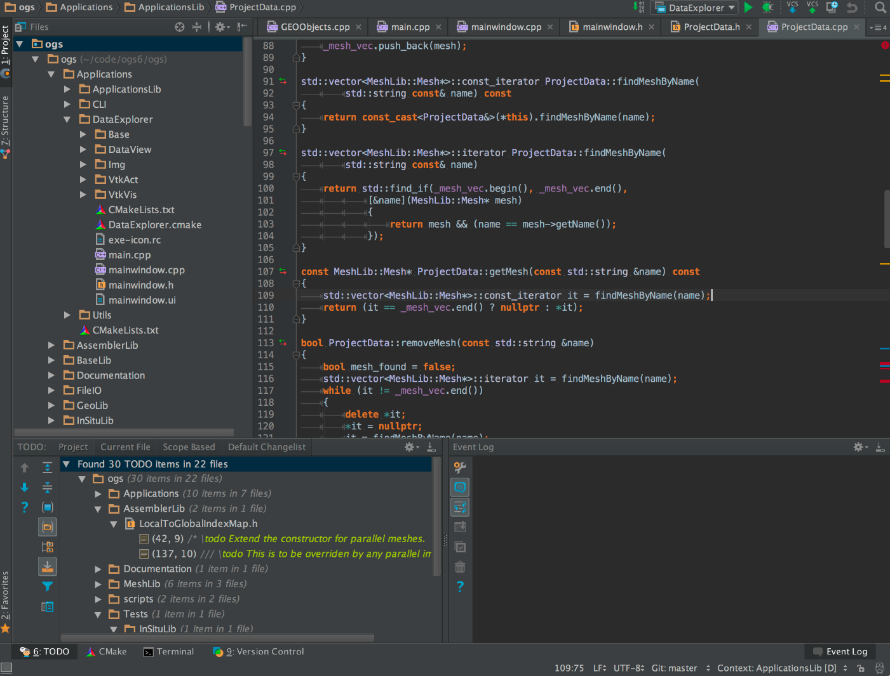

**CLion** est un IDE C et C++ multi-plateforme et propriétaire proposé par *JetBrains*.

Il s’appuie sur la plateforme **Intellij** de JetBrains (sur lesquels sont basés les IDE de JetBrains : *PhPStorm*, *Intellij IDEA*, *AppCode* etc…).

Outre le C et le C++, **CLion** supporte aussi d'autres langages tels que Kotlin, Python, Rust, Swift etc...

