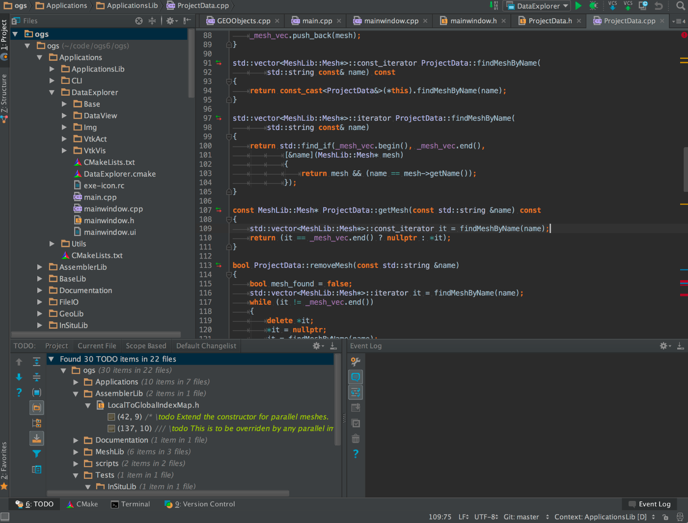
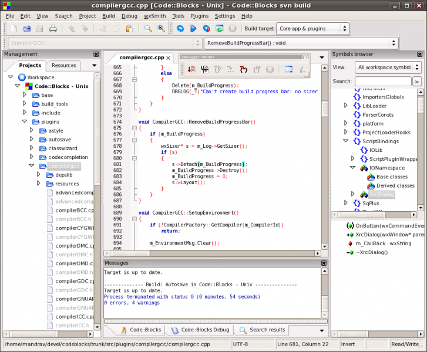
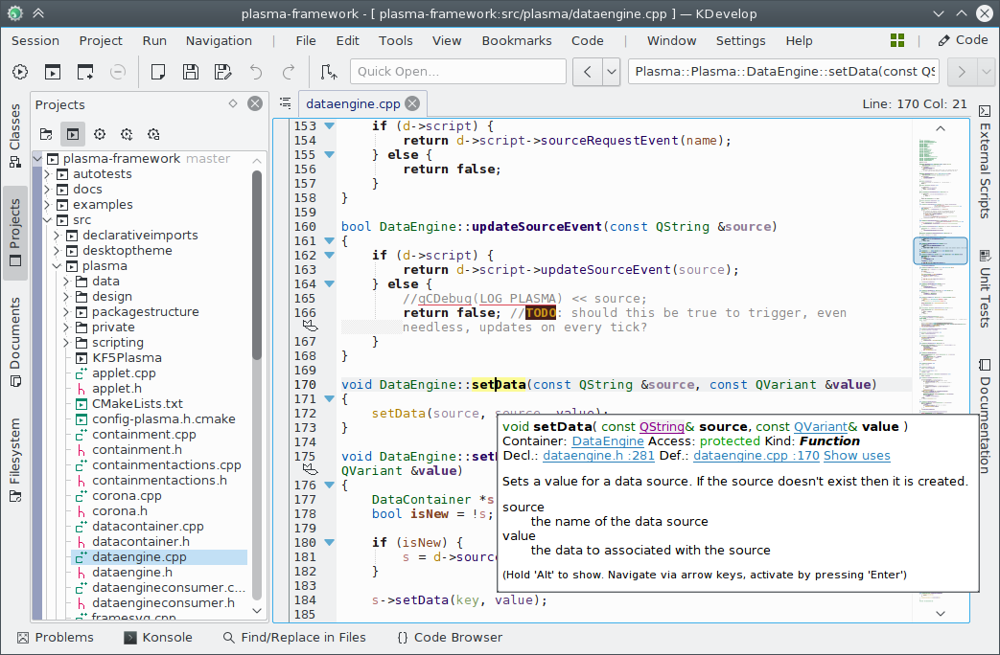
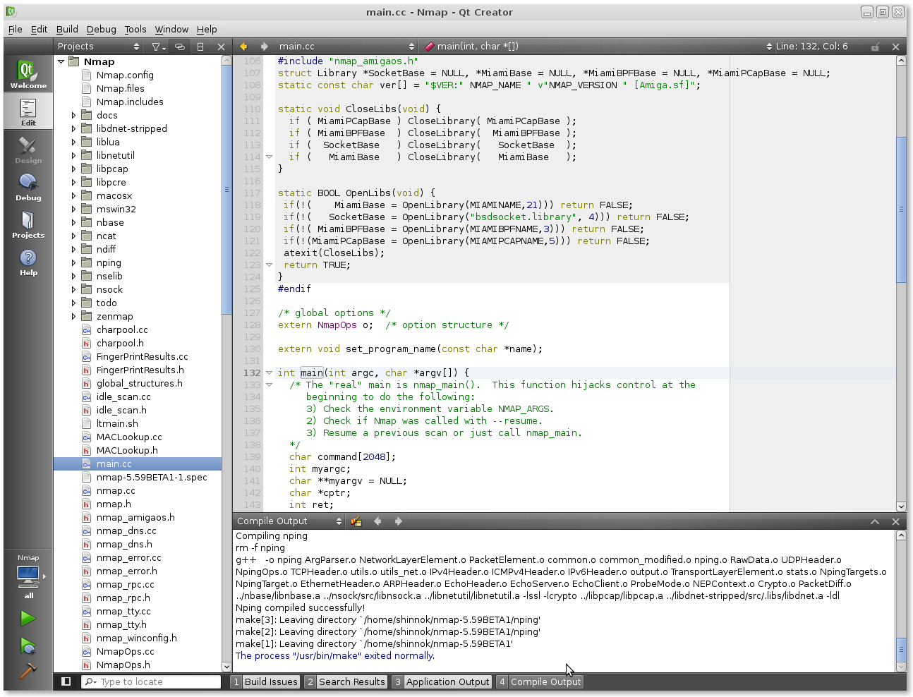

# Les IDEs

### Sommaire

**En cours d'écriture**

## Qu'est-ce qu'un IDE ?

Un *Integrated Development Environment* (**IDE**), *EDI* en français, est un ensemble d'outils utilisé pour le développement d'une application, généralement proposé sous la forme d'un logiciel.

Les outils proposés sont variables, on retrouve souvent un éditeur de texte, un compilateur, des outils d'automatisation de compilation et de génération d'exécutable (build automation), un debugger...

Parfois, ces outils peuvent être interchangés. Par exemple, les IDEs C++ proposent souvent de modifier le compilateur utilisé.

Beaucoup d'IDE sont disponibles pour le C++, parmi lesquels  *CLion*, *Code::Block*, *KDevelop*, *Eclipse*, *Netbeans*, *QtCreator*, *Visual Studio*, *XCode*...

Il est tout à fait possible de se passer d'un IDE et de se contenter d'un "simple" éditeur de texte (vim, Emacs, Sublim Text, Atom, Visual Code, Notepad++ etc...). Il est alors nécessaire d'utiliser séparément les différents outils habituellement inclus dans l'IDE.

## Quel est le meilleur IDE ?

Cette question est tout à fait subjective, même s'il serait possible d'argumenter en comparant les différentes fonctionnalité des IDE majeurs.

Certains développeurs préféreront un IDE spécifique, d'autres utiliseront différents IDE suivant leurs besoins et d'autres encore choisiront de ne pas utiliser d'IDE.

Cette FAQ donne une brève description de quelques-uns des IDE les plus connus pour le langage C++, mais la meilleur façon de faire son choix reste encore de les essayer par soi-même.

#### Liens et compléments
 - **[EN]** [wikipedia.org | Comparaison des IDEs](https://en.wikipedia.org/wiki/Comparison_of_integrated_development_environments#C/C++)
 - [Quel est le meilleur compilateur C++ ?](https://github.com/cpp-faq/cpp-faq/tree/develop/faq/fr-FR/.faq/404.md)

## Qu'est-ce que CLion ?

**CLion** est un IDE C et C++ multi-plateforme et propriétaire proposé par *JetBrains*.

Il s’appuie sur la plateforme **Intellij** de JetBrains (sur lesquels sont basés les IDE de JetBrains : *PhPStorm*, *Intellij IDEA*, *AppCode* etc…).

Outre le C et le C++, **CLion** supporte aussi d'autres langages tels que Kotlin, Python, Rust, Swift etc...

#### Liens et compléments
 - [Téléchargement de CLion](https://www.jetbrains.com/clion/download/)

## Qu'est-ce que Code::Blocks ?

**Code::Blocks** est un IDE C, C++ et Fortran open-source et multi-plateforme développé par The Code::Blocks team depuis 2005.

Il supporte plusieurs compilateurs tels que Clang, GCC et MSVC.

#### Liens et compléments
 - [Téléchargement de Code::Blocks](http://www.codeblocks.org/downloads)

## Qu'est-ce que Kdevelop ?

**KDevelop** est un IDE multi-plateforme et open-source développé par un projet communautaire issu de *KDE*.

L’environnement de bureau *KDE* (Plasma) étant basé sur *Qt*, **KDevelop** propose directement le support de Qt (C++/Qt, QML etc…) et propose un back-end pour d'autres langages tels que C, Objective-C, JavaScript etc.

**KDevelop** utilise en interne le modèle de code **CLang**.

#### Liens et compléments
 - [Téléchargement de KDevelop](https://www.kdevelop.org/download)
 - [Dépôt Github de KDevelop](https://github.com/KDE/kdevelop)

## Qu'est-ce que QtCreator ?

**QtCreator** est l'IDE multi-plateforme proposé par le *Qt Projet*. Gratuit et open-source, il fait partie du SDK (Software Development Kit) de *Qt*.

Il est particulièrement adapté au développement d'application utilisant le Framework Qt puisqu'il inclue des outils tes que *QtDesigner*, le système de ressources ou encore la documentation Qt intégrée. Il peut cependant être utilisé pour du développement C++ sans Qt.

Outre le **C++** et la bibliothèque **Qt**, il supporte aussi le *JavaScript* et le *QML*, un langage spécifique à *Qt*.

#### Liens et compléments
 - [Dépôt Github de QtCreator](https://github.com/qtproject/qt-creator)
 - [Qu'est-ce que Qt ?](https://github.com/cpp-faq/cpp-faq/tree/develop/faq/fr-FR/.faq/404.md)

## Qu'est-ce que Visual Studio ?

**Visual Studio** est l'IDE de Microsoft, uniquement disponible sur la plateforme Windows. L'édition *Community* gratuite est disponible pour tous les étudiants, enseignants, développeurs indépendants et entreprises de moins de 5 développeurs.

VS fourni par défaut le compilateur **MSVC**. Il supporte également le développement en C, les langages .NET (C#, C++/CLI, F#, ASP.NET...), JavaScript et Python.

#### Liens et compléments
 - [Microsft Visual Studio](https://visualstudio.microsoft.com/fr/)
 - [Qu'est-ce que MSVC ?](https://github.com/cpp-faq/cpp-faq/tree/develop/faq/fr-FR/.faq/404.md)
